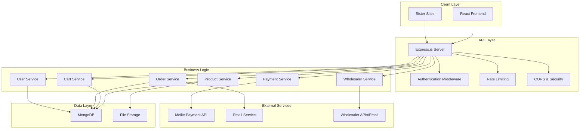

# Design Document

## Overview

The holistic dropshipping store is a Node.js/Express-based e-commerce platform built on MongoDB with Mongoose ODM. The system follows a RESTful API architecture with a React frontend (to be implemented), supporting both registered users and guest checkout. The platform integrates with Mollie for payment processing and automatically communicates with wholesalers for order fulfillment without inventory management.

Key design principles:
- Dropshipping model with no inventory tracking
- Cross-site integration optimized for sister sites
- Secure payment processing with multiple options
- Automated wholesaler communication
- SEO-friendly product pages for external linking

## Architecture

### System Architecture



### Technology Stack

- **Backend**: Node.js with Express.js framework
- **Database**: MongoDB with Mongoose ODM
- **Authentication**: JWT tokens with bcryptjs for password hashing
- **Payment Processing**: Mollie API for cards and cryptocurrency
- **Security**: Helmet, CORS, rate limiting, input validation
- **File Handling**: Multer for image uploads
- **Email**: Nodemailer for transactional emails
- **Frontend**: React (to be implemented)

## Components and Interfaces

### Core Models

#### Product Model
- Extended existing model with cross-site integration fields
- Includes wholesaler information for automated ordering
- SEO optimization fields for external linking
- Holistic-specific properties (chakra, elements, healing properties)

#### User Model  
- Supports multiple addresses (shipping/billing)
- User preferences and newsletter subscriptions
- Account management with secure authentication

#### Order Model
- Supports both registered users and guest checkout
- Tracks wholesaler notification status per item
- Includes referral source tracking for sister sites
- Payment integration with Mollie

### API Endpoints Structure

#### Authentication Routes (`/api/auth`)
- `POST /register` - User registration
- `POST /login` - User authentication
- `POST /logout` - Session termination
- `POST /forgot-password` - Password reset initiation
- `POST /reset-password` - Password reset completion
- `GET /profile` - User profile retrieval
- `PUT /profile` - User profile updates

#### Product Routes (`/api/products`)
- `GET /` - Product catalog with filtering/search
- `GET /:slug` - Individual product by slug (SEO-friendly)
- `GET /category/:category` - Products by category
- `GET /search` - Product search functionality
- `POST /` - Admin: Create product
- `PUT /:id` - Admin: Update product
- `DELETE /:id` - Admin: Delete product

#### Cart Routes (`/api/cart`)
- `GET /` - Retrieve cart contents
- `POST /add` - Add item to cart
- `PUT /update` - Update cart item quantity
- `DELETE /remove` - Remove item from cart
- `DELETE /clear` - Clear entire cart

#### Order Routes (`/api/orders`)
- `POST /` - Create new order (guest or registered)
- `GET /` - User: Get order history
- `GET /:id` - Get specific order details
- `PUT /:id/status` - Admin: Update order status
- `GET /admin` - Admin: All orders management

#### Payment Routes (`/api/payments`)
- `POST /create` - Create Mollie payment
- `POST /webhook` - Mollie webhook handler
- `GET /status/:paymentId` - Check payment status
- `POST /refund` - Admin: Process refunds

#### Wholesaler Routes (`/api/wholesalers`)
- `POST /notify` - Send order to wholesaler
- `GET /orders/:orderId` - Check notification status
- `PUT /retry/:orderId` - Retry failed notifications

### Cross-Site Integration Interface

#### Product Linking API
- `GET /api/products/link/:referenceKey` - Get product by reference key
- `GET /api/products/embed/:slug` - Embeddable product widget
- `GET /api/products/related/:contentId` - Products related to content

#### Analytics and Tracking
- Referral source tracking in orders
- Cross-site traffic analytics
- Product link performance metrics

## Data Models

### Enhanced Product Schema
```javascript
{
  // Core product info
  name: String,
  slug: String (unique, SEO-friendly),
  description: String,
  shortDescription: String,
  price: Number,
  compareAtPrice: Number,
  
  // Media
  images: [{
    url: String,
    alt: String,
    isPrimary: Boolean
  }],
  
  // Categorization
  category: String (enum),
  tags: [String],
  
  // Holistic-specific properties
  properties: {
    chakra: [String],
    element: [String],
    zodiac: [String],
    healing: [String],
    origin: String,
    size: String,
    weight: String
  },
  
  // Dropshipping
  wholesaler: {
    name: String,
    email: String,
    productCode: String,
    cost: Number,
    minOrderQty: Number
  },
  
  // SEO & Cross-site
  seo: {
    title: String,
    description: String,
    keywords: [String]
  },
  
  crossSiteIntegration: {
    enabled: Boolean,
    referenceKey: String,
    relatedContent: [String]
  }
}
```

### Order Processing Schema
```javascript
{
  orderNumber: String (auto-generated),
  customer: ObjectId (optional for guest),
  guestInfo: {
    email: String,
    firstName: String,
    lastName: String,
    phone: String
  },
  
  items: [{
    product: ObjectId,
    quantity: Number,
    price: Number,
    wholesaler: {
      name: String,
      email: String,
      productCode: String,
      notified: Boolean,
      notifiedAt: Date
    }
  }],
  
  addresses: {
    shipping: AddressSchema,
    billing: AddressSchema
  },
  
  pricing: {
    subtotal: Number,
    tax: Number,
    shipping: Number,
    total: Number
  },
  
  payment: {
    method: String (enum: card, crypto),
    status: String (enum),
    molliePaymentId: String,
    transactionId: String,
    paidAt: Date
  },
  
  status: String (enum),
  referralSource: String
}
```

## Error Handling

### API Error Response Format
```javascript
{
  success: false,
  error: {
    code: "ERROR_CODE",
    message: "Human readable message",
    details: {} // Additional context when needed
  }
}
```

### Error Categories

#### Validation Errors (400)
- Invalid input data
- Missing required fields
- Format validation failures

#### Authentication Errors (401)
- Invalid credentials
- Expired tokens
- Missing authentication

#### Authorization Errors (403)
- Insufficient permissions
- Account restrictions

#### Resource Errors (404)
- Product not found
- Order not found
- User not found

#### Payment Errors (402)
- Payment processing failures
- Insufficient funds
- Invalid payment methods

#### External Service Errors (502/503)
- Mollie API failures
- Wholesaler communication failures
- Email service failures

### Error Recovery Strategies

#### Payment Failures
- Automatic retry with exponential backoff
- Alternative payment method suggestions
- Order preservation for retry attempts

#### Wholesaler Communication Failures
- Queue-based retry system
- Manual retry interface for admins
- Fallback email notifications

#### Database Connection Issues
- Connection pooling and retry logic
- Graceful degradation for read operations
- Circuit breaker pattern for external services

## Testing Strategy

### Unit Testing
- Model validation and methods
- Service layer business logic
- Utility functions and helpers
- Authentication and authorization logic

### Integration Testing
- API endpoint functionality
- Database operations
- External service integrations (Mollie, email)
- Cross-site integration endpoints

### End-to-End Testing
- Complete user registration and login flows
- Guest checkout process
- Registered user checkout process
- Payment processing workflows
- Order fulfillment automation
- Cross-site product linking

### Performance Testing
- API response times under load
- Database query optimization
- Image loading and optimization
- Concurrent user scenarios

### Security Testing
- Authentication bypass attempts
- SQL injection prevention
- XSS protection validation
- Rate limiting effectiveness
- Payment data security

### Test Data Management
- Seed data for development
- Mock external services for testing
- Test user accounts and scenarios
- Sample product catalog with wholesaler data

### Monitoring and Alerting
- Payment processing success rates
- Wholesaler notification success rates
- API response times and error rates
- Database performance metrics
- Cross-site referral tracking