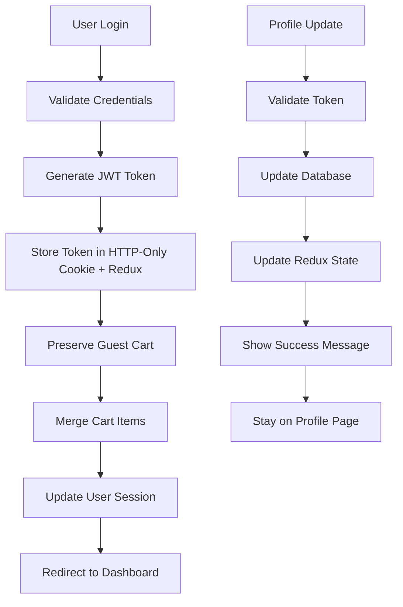
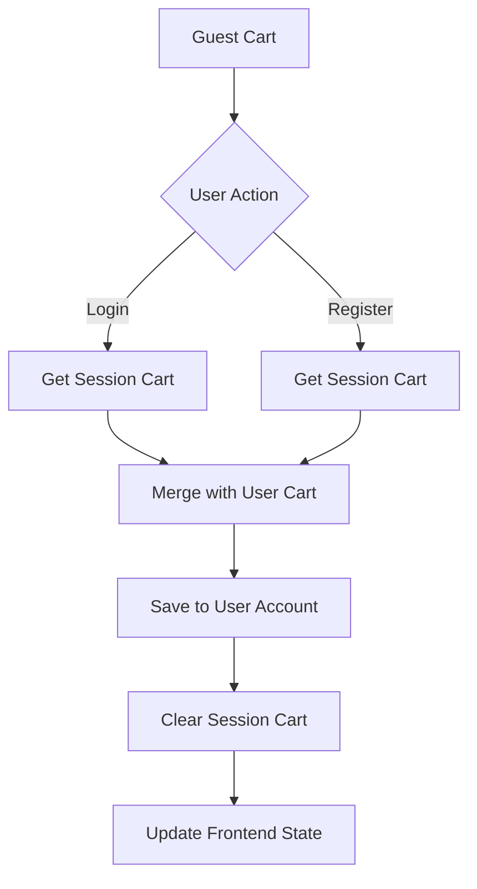

# User Profile Management Design

## Overview

This design addresses the critical issues with user profile management, authentication persistence, and cart preservation. The solution focuses on fixing the authentication flow, implementing proper state management, and ensuring data consistency across the application.

## Architecture

### Authentication Flow Redesign



### Cart Preservation Strategy



## Components and Interfaces

### 1. Authentication Service Enhancement

**Purpose:** Fix authentication state management and token handling

**Key Changes:**
- Implement dual token storage (HTTP-only cookies + Redux for UI state)
- Add automatic token refresh mechanism
- Fix authentication persistence across page reloads
- Implement proper logout cleanup

**Interface:**
```javascript
class AuthService {
  async login(credentials) {
    // Validate credentials
    // Generate tokens
    // Store in cookies and Redux
    // Preserve guest cart
    // Return user data
  }
  
  async refreshToken() {
    // Check token expiry
    // Refresh if needed
    // Update storage
  }
  
  async updateProfile(userData) {
    // Update without losing authentication
    // Validate data
    // Update Redux state
    // Return updated user
  }
}
```

### 2. Cart Preservation Service

**Purpose:** Handle cart merging between guest and authenticated states

**Key Changes:**
- Implement session-based cart storage for guests
- Add cart merging logic for login/registration
- Fix localStorage vs session mismatch
- Ensure cart persistence across authentication changes

**Interface:**
```javascript
class CartPreservationService {
  async preserveGuestCart() {
    // Get current session cart
    // Store temporarily
    // Return cart data
  }
  
  async mergeCartOnLogin(guestCart, userCart) {
    // Combine cart items
    // Handle duplicates
    // Update quantities
    // Save to user account
  }
  
  async transferCartToUser(userId, cartItems) {
    // Associate cart with user
    // Clear session cart
    // Update database
  }
}
```

### 3. Profile Management Component

**Purpose:** Fix profile updates without authentication loss

**Key Changes:**
- Remove forced re-authentication after updates
- Implement optimistic UI updates
- Add proper error handling
- Fix form state management

**Interface:**
```javascript
const ProfileManager = {
  async updateProfile(profileData) {
    // Validate input
    // Update backend
    // Update Redux state
    // Show feedback
    // Stay on current page
  },
  
  async updateAddress(addressData) {
    // Validate address
    // Update user addresses
    // Update UI state
    // Provide feedback
  }
}
```

### 4. Session Management Middleware

**Purpose:** Handle session consistency and CSRF tokens

**Key Changes:**
- Automatic CSRF token management
- Session synchronization
- Token validation consistency
- Error recovery mechanisms

## Data Models

### Enhanced User Model
```javascript
{
  _id: ObjectId,
  email: String,
  firstName: String,
  lastName: String,
  phone: String,
  addresses: [{
    type: String, // 'shipping', 'billing'
    firstName: String,
    lastName: String,
    street: String,
    city: String,
    state: String,
    zipCode: String,
    country: String,
    isDefault: Boolean
  }],
  preferences: {
    newsletter: Boolean,
    notifications: Boolean,
    emailPreferences: {
      orderConfirmations: Boolean,
      paymentReceipts: Boolean,
      orderUpdates: Boolean,
      promotionalEmails: Boolean,
      welcomeEmails: Boolean
    }
  },
  cart: {
    items: [{
      product: ObjectId,
      quantity: Number,
      price: Number,
      addedAt: Date
    }],
    updatedAt: Date
  },
  lastLogin: Date,
  isActive: Boolean,
  createdAt: Date,
  updatedAt: Date
}
```

### Session Cart Model
```javascript
{
  sessionId: String,
  items: [{
    productId: ObjectId,
    quantity: Number,
    price: Number,
    addedAt: Date
  }],
  createdAt: Date,
  updatedAt: Date,
  expiresAt: Date
}
```

## Error Handling

### Authentication Errors
- **Token Expired:** Automatic refresh attempt, fallback to login
- **Invalid Token:** Clear state and redirect to login
- **Network Error:** Retry mechanism with exponential backoff
- **Validation Error:** Show specific field errors without losing auth

### Profile Update Errors
- **Validation Errors:** Highlight problematic fields, maintain form state
- **Duplicate Email:** Show clear error message, suggest alternatives
- **Network Errors:** Provide retry option, maintain unsaved changes
- **Permission Errors:** Refresh authentication, retry operation

### Cart Preservation Errors
- **Merge Conflicts:** Combine quantities, notify user of changes
- **Product Unavailable:** Remove item, notify user
- **Session Expired:** Attempt recovery, fallback to empty cart
- **Database Errors:** Retry operation, maintain local state

## Testing Strategy

### Unit Tests
- Authentication service methods
- Cart preservation logic
- Profile update functions
- Error handling scenarios

### Integration Tests
- Login → Profile Update → Logout flow
- Guest Cart → Login → Cart Preservation flow
- Registration → Cart Merge → Profile Update flow
- Token refresh and session management

### End-to-End Tests
- Complete user journey from guest to registered user
- Profile management across multiple sessions
- Cart persistence across authentication changes
- Error recovery scenarios

## Security Considerations

### Token Management
- HTTP-only cookies for sensitive tokens
- Secure flag for HTTPS environments
- Proper token expiration and refresh
- CSRF protection for state-changing operations

### Data Validation
- Server-side validation for all profile updates
- Email uniqueness checks
- Input sanitization and validation
- Rate limiting for profile update operations

### Session Security
- Secure session storage
- Session invalidation on logout
- Protection against session fixation
- Proper cleanup of expired sessions

## Performance Optimizations

### Caching Strategy
- Redis caching for user sessions
- Optimistic UI updates for better UX
- Debounced profile updates
- Efficient cart state management

### Database Optimization
- Indexed queries for user lookups
- Efficient cart item updates
- Batch operations for cart merging
- Connection pooling for high concurrency

## Migration Strategy

### Phase 1: Fix Authentication Issues
1. Update authentication middleware
2. Fix token storage and management
3. Implement proper session handling
4. Test authentication flows

### Phase 2: Implement Cart Preservation
1. Add session-based cart storage
2. Implement cart merging logic
3. Update frontend cart management
4. Test cart preservation flows

### Phase 3: Fix Profile Management
1. Remove forced re-authentication
2. Implement optimistic updates
3. Add proper error handling
4. Test profile update flows

### Phase 4: Integration and Testing
1. End-to-end testing
2. Performance optimization
3. Security audit
4. User acceptance testing